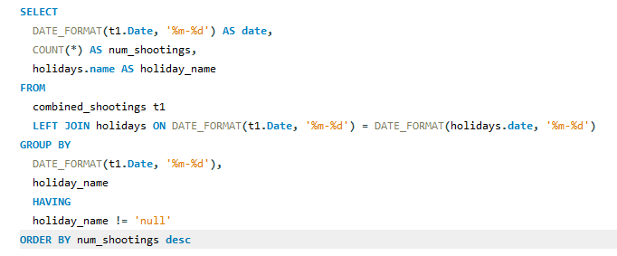
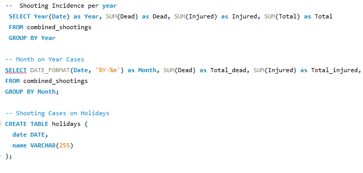
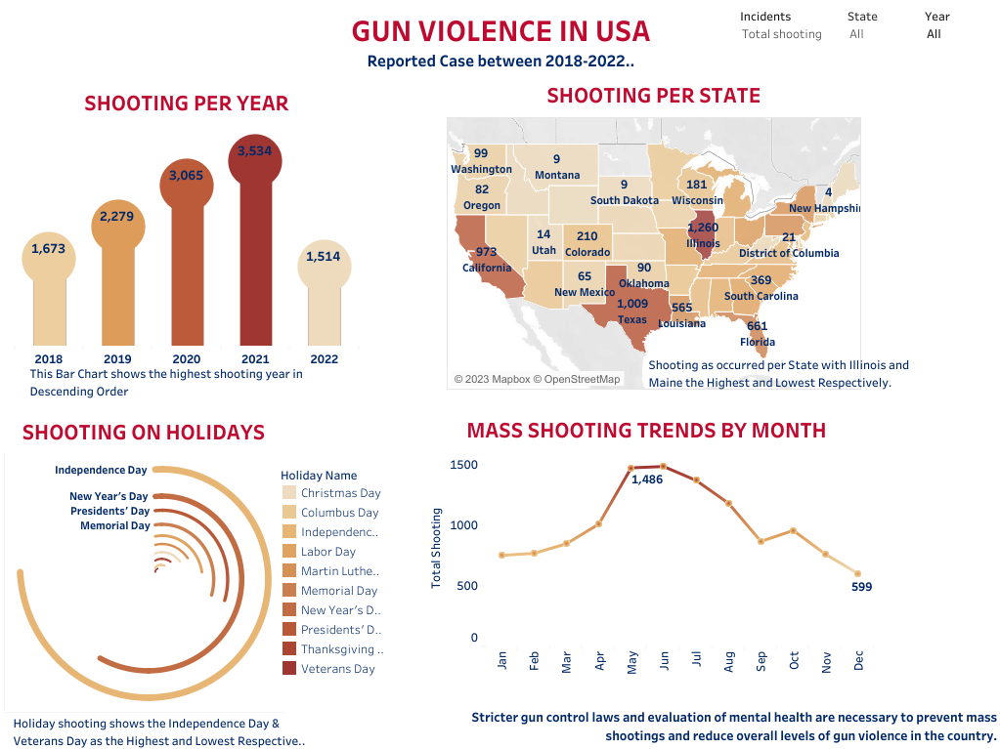

# Mass-Shooting-in-USA

Gun violence in the United States include mass shootings, homicides, suicides, and accidental shootings. From the data, U.S.A. recorded a total number of 694 cases of mass shooting with 2,836 injured and 701 dead in 2021. The number of people killed or injured in these incidents can vary widely, but the impact on individuals, families, and communities is often devastating.

A comprehensive dataset of 2356 rows was gotten from the Kaggle database and analysed to get insights into the pattern of gun violence in the USA over the period of 5 years ranging from from 2018 - 2022.

The causes of gun violence in the United States are complex and multifaceted, and there is no single solution that will eliminate the problem entirely. Factors that contribute to gun violence include easy access to firearms, social and economic inequality, mental illness, and a culture of violence and aggression.

## Problem Statements
- Which year has the most recorded mass shooting incidence?
- Which state has the highest gun violence victims?
- How many shooting incidence happened on Holidays?
- What is the monthly trends of mass shooting incidence?

## Analysis
The Mass shooting dataset was gotten from kaggle. SQl was the tool of choice used to clean, process and interact with the 2,356 rows of data. Attached [here](https://github.com/DayoDak/Mass-Shooting-in-USA/blob/73324fda979f29a7c8557a26d7d4de44942581a1/USA%20Mass%20Shooting.sql) is the sql file used to querry the data and below is a selected summary screenshots of the querries used. 👇
|
:----------------:|:-----------------:

## Visualisation
Tableau was used for the visualisation of the insights gotten from the dataset. The visual was spread across the Bar, Map, Radial and line graph charts. An interactive minimalist [dashboard](https://public.tableau.com/views/MassShootinginUSA_16784575287990/Dashboard1?:language=en-US&:display_count=n&:origin=viz_share_link) was designed to answer different questions that comes to mind, cool right 🙈

Here is what to expect 👇

## Conclusions and Recommendations
- There's been an exponential increase in Gun violence in the United States over the years.
- Illinios and Texas has the highest gun violence incidence in the country.

Overall, gun violence remains a complex and multifaceted issue in the United States, and addressing it will require a comprehensive approach that addresses both the availability of firearms and the underlying social and economic factors that contribute to violence.
Stricter gun control laws and evaluation of mental health are necessary to prevent mass shootings and reduce overall levels of gun violence in the country.

Efforts should be made to address the root causes of gun violence, such as poverty, mental illness, and social isolation. These efforts must include improving access to mental health services, reducing economic inequality, and increasing funding for community programs that promote social connection and support.
